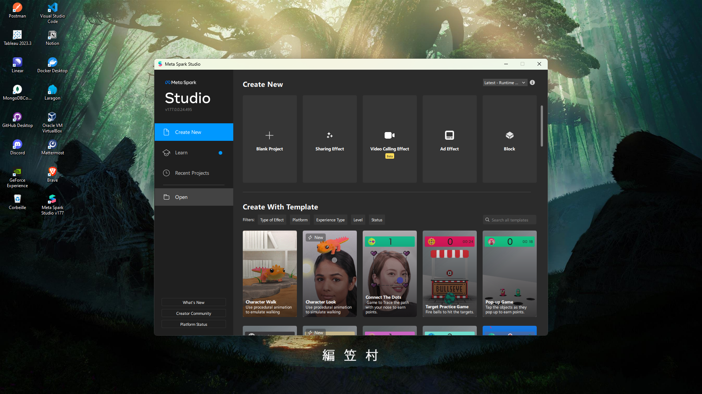
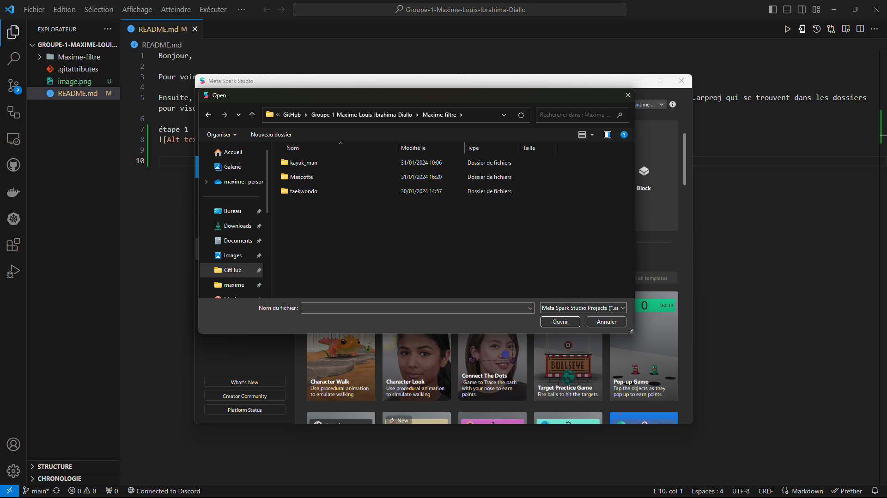
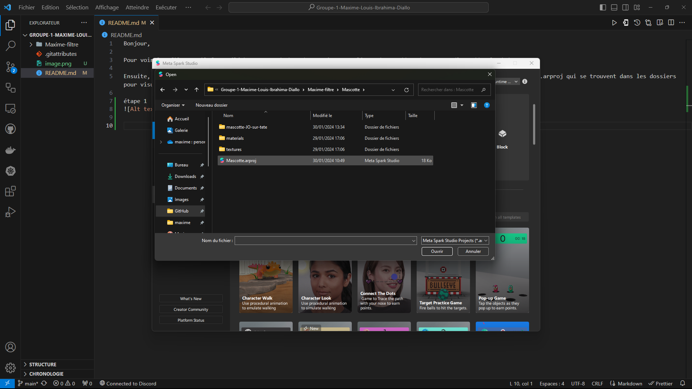

Bonjour,

GitHub https : (https://github.com/maxime-louis14/Groupe-1-Maxime-Louis-Ibrahima-Diallo.git)

Pour voir les filtres, il faut télécharger Spark (meta) en suivant ce lien : https://spark.meta.com/learn/downloads/

Ensuite, vous devrez ouvrir le dossier téléchargé et sélectionner les fichiers : taekwondo.arproj, Mascotte.arproj, kayak_man.arproj qui se trouvent dans les dossiers pour visualiser le filtre choisi.

étape 1

2) 

3)
